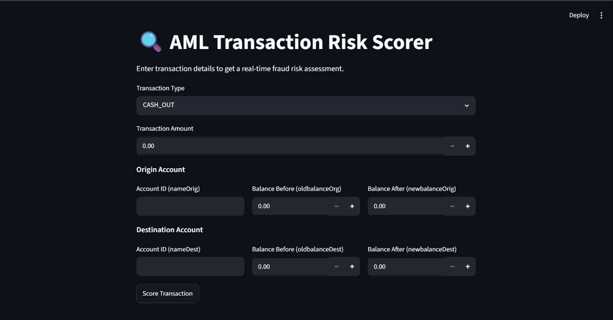

# AML Risk API

An Anti-Money Laundering (AML) transaction risk scoring system built on the [PaySim](https://www.kaggle.com/datasets/ealaxi/paysim1) synthetic mobile money dataset. The project covers the full ML lifecycle — data ingestion, exploratory analysis, model comparison, training, and production serving — all containerized with Docker Compose.

---

## Demo



---

## Architecture

```
aml-risk-api/
├── download_data.py            # Kaggle dataset fetch script
├── train_model.py              # Train winner model on full data, save artifacts
├── sample_requests.json        # Known fraud + legitimate payloads for testing
├── docker-compose.yml
├── api/
│   ├── main.py                 # FastAPI app — GET /, GET /health, POST /predict
│   ├── schema/
│   │   ├── user_input.py       # Pydantic request model; derives 12 features via @computed_field
│   │   └── prediction_response.py  # Pydantic response model (score, band, label, threshold)
│   ├── model/
│   │   ├── predict.py          # Loads model.pkl + config.json, exposes predict()
│   │   ├── model.pkl           # Serialized sklearn/XGBoost model
│   │   ├── config.json         # Decision threshold + feature columns + risk band boundaries
│   │   └── metrics.json        # Eval metrics snapshot
│   ├── requirements.txt
│   └── Dockerfile
├── ui/
│   ├── app.py                  # Streamlit front-end — calls POST /predict
│   ├── requirements.txt
│   └── Dockerfile
└── notebooks/
    ├── 1_eda.ipynb             # Exploratory data analysis
    ├── 02_model_comparision.ipynb  # Candidate model comparison
    ├── 1_eda_report.md         # GitHub-readable EDA summary
    └── docs/                   # Quarto-rendered HTML reports
```

### Request → Response flow

1. The Streamlit UI submits a transaction JSON to `POST /predict`.
2. `user_input.py` validates the 8 raw fields and derives 12 features via `@computed_field`.
3. `predict.py` loads `model.pkl` and applies the trained classifier to produce a fraud probability.
4. The probability is mapped to a named risk band using the cutoffs in `config.json`.
5. `prediction_response.py` structures the response: risk score, risk band, `is_fraud` label, and the threshold applied.

---

## Quickstart

### 1. Get the training data

The PaySim CSV is too large for git and is excluded via `.gitignore`.
Download it from Kaggle and place it in the `data/` folder:

[PaySim Dataset — Kaggle](https://www.kaggle.com/datasets/ealaxi/paysim1)

Expected path: `data/PS_20174392719_1491204439457_log.csv`

### 2. Set up the Python environment

```bash
python -m venv venv
venv\Scripts\activate        # Windows
# source venv/bin/activate   # macOS / Linux

pip install -r api/requirements.txt
pip install -r ui/requirements.txt
```

### 3. Train the model

```bash
python train_model.py
```

This writes the following artifacts to `api/model/`:

- `model.pkl` — serialized XGBoost classifier
- `config.json` — decision threshold + feature columns + risk band cutoffs
- `metrics.json` — evaluation metrics snapshot (PR-AUC, F1, threshold)

### 4. Run with Docker Compose (recommended)

```bash
docker compose up --build
```

| Service | URL |
|---------|-----|
| API | http://localhost:8000 |
| UI | http://localhost:8501 |

### 5. Run individual services (dev mode)

**Important:** run from the repo root, not from inside `api/`, because imports use the `api.` package prefix.

```bash
# API
uvicorn api.main:app --reload --host 0.0.0.0 --port 8000

# UI — update API_URL in ui/app.py to http://localhost:8000/predict
streamlit run ui/app.py
```

---

## API reference

### `POST /predict`

Scores a single transaction and returns a risk assessment.

**Request body** (JSON):

```json
{
  "type": "CASH_OUT",
  "amount": 187629.11,
  "nameOrig": "C1231006815",
  "oldbalanceOrg": 187629.11,
  "newbalanceOrig": 0.0,
  "nameDest": "C553264065",
  "oldbalanceDest": 0.0,
  "newbalanceDest": 187629.11
}
```

**Response** (JSON):

```json
{
  "risk_score": 0.9978,
  "risk_band": "high",
  "is_fraud": true,
  "threshold_used": 0.909418
}
```

### `GET /health`

Returns service and model status — suitable for container health checks.

```json
{
  "status": "ok",
  "model_loaded": true,
  "n_features": 17,
  "threshold": 0.909418
}
```

### `GET /`

Returns API metadata and version info.

Interactive docs are available at `http://localhost:8000/docs`.

---

## Feature engineering

`UserInput` derives 12 features from the 8 raw API inputs via `@computed_field`:

| Group | Features |
|-------|----------|
| Raw PaySim | `amount`, `oldbalanceOrg`, `newbalanceOrig`, `oldbalanceDest`, `newbalanceDest` |
| Type flags | `is_cash_out`, `is_transfer` |
| Balance errors | `error_balance_orig`, `error_balance_dest` |
| Balance states | `orig_balance_zero_before`, `orig_balance_zero_after`, `dest_balance_zero_before` |
| Ratios / deltas | `amount_to_orig_balance`, `amount_to_dest_balance`, `balance_change_orig`, `balance_change_dest` |
| Identity | `dest_is_merchant` (`nameDest` starts with `"M"`) |

The full feature list used by the model is defined in `api/model/config.json` under `feature_columns`.

---

## Risk bands

Risk band boundaries are defined in `api/model/config.json` and are not hardcoded in application logic.

| Band | Score range | Description |
|------|-------------|-------------|
| `low` | < 0.3 | Likely legitimate transaction |
| `medium` | 0.3 – 0.7 | Elevated risk, warrants review |
| `high` | ≥ 0.7 | High fraud probability, flag for investigation |

---

## Model performance

Metrics are sourced from `api/model/metrics.json` (authoritative — do not hardcode elsewhere).

| Metric | Value |
|--------|-------|
| PR-AUC | 0.9987 |
| ROC-AUC | 0.9996 |
| Precision | 1.0000 |
| Recall | 0.9976 |
| F1 | 0.9988 |
| Decision threshold | 0.909418 |
| Test fraud / total | 1 643 / 1 272 524 |

The threshold is tuned for maximum F1 on a heavily imbalanced dataset (~0.13% fraud rate). Changing it shifts the precision/recall trade-off; update both `config.json` and `metrics.json` together.

---

## Notebooks

Notebooks are rendered to HTML via [Quarto](https://quarto.org/) and committed under `notebooks/docs/`.

```bash
quarto render notebooks/1_eda.ipynb --to html --output-dir docs
quarto render notebooks/02_model_comparision.ipynb --to html --output-dir docs
```

| Notebook | Purpose |
|----------|---------|
| `1_eda.ipynb` | Class imbalance, feature distributions, correlation analysis |
| `02_model_comparision.ipynb` | Compares candidate models (precision, recall, AUC-PR), selects winner |

A GitHub-readable EDA summary is also available at [`notebooks/1_eda_report.md`](notebooks/1_eda_report.md).

---

## Dataset

[PaySim](https://www.kaggle.com/datasets/ealaxi/paysim1) is a synthetic mobile money transaction simulator based on real transaction logs. It contains ~6.3 million transactions with a ~0.13% fraud rate, making it a realistic highly-imbalanced classification benchmark.

---

## License

This project is for educational and demonstration purposes. The PaySim dataset is provided by Kaggle under its own terms.
